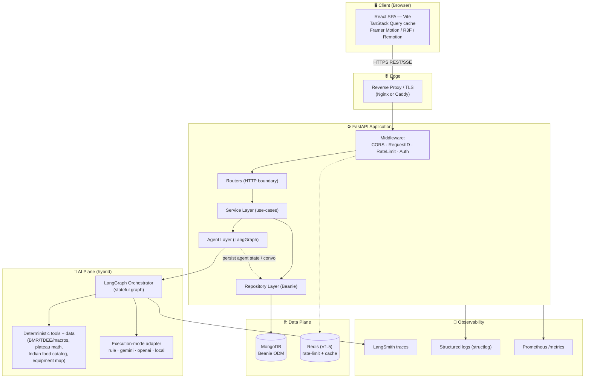
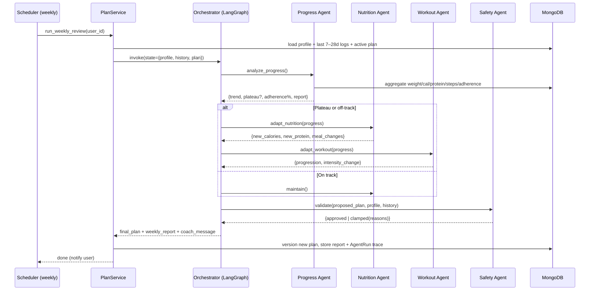
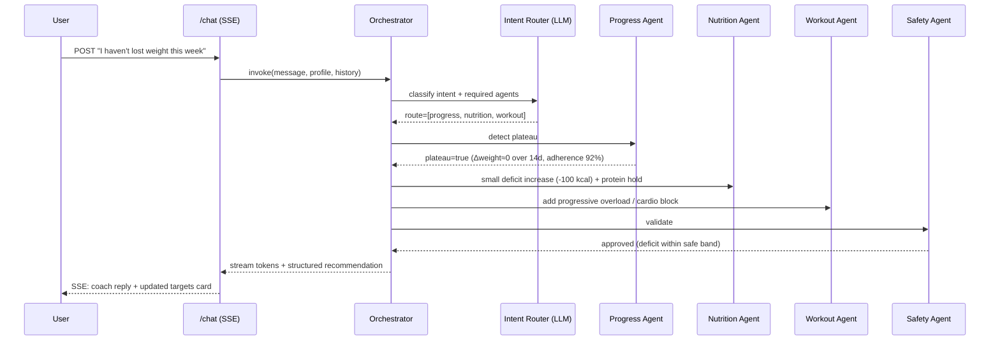
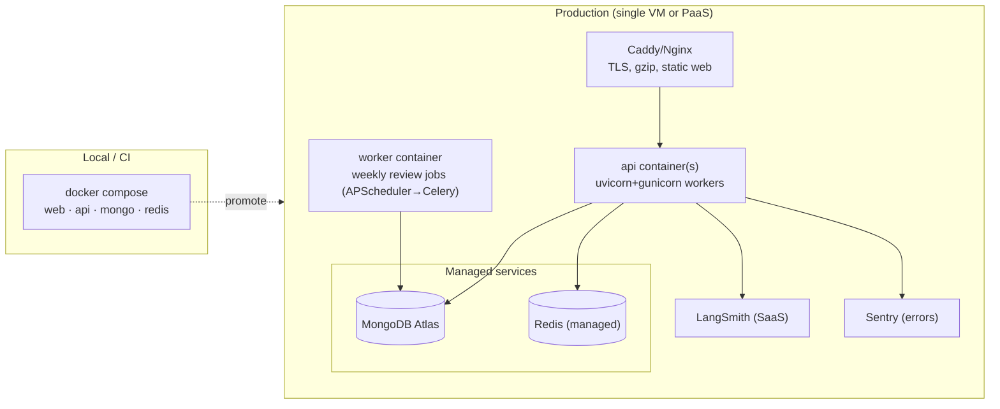
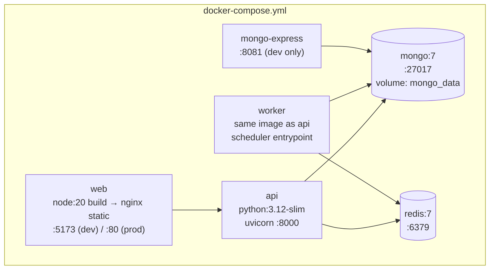

# 01 · System Architecture

> Staff-engineer note: every box below earns its place. I call out the decision and the alternative I rejected
> so this reads like a design review, not a diagram dump.

---

## 1. High-Level Architecture



### Why these layers (and the boundary rules)

- **Router → Service → Agent → Repository, strictly downward.** Routers only do HTTP (parse, authz, serialize).
  Services own use-cases and transactions. The **agent layer is just another service collaborator** — it never
  touches HTTP or the DB driver directly; it gets data handed in and returns structured results. Repositories are
  the *only* code that imports Beanie. This keeps the AI swappable and the DB swappable independently.
- **Deterministic math is NOT done by the LLM.** BMR/TDEE/macros/plateau detection are pure Python tools the
  agents *call*. LLMs are great at language and synthesis, bad at arithmetic you can be sued over. This is the
  single most important reliability decision in the system.
- **The agent layer is hybrid, not "all-LLM" or "all-rules."** Each agent declares a mode — **rule-based**
  (Progress, Safety), **LLM-powered** (Nutrition, Motivation, Coach), or **hybrid** (Workout, Orchestrator) — and
  the model behind every LLM-touching agent is **pluggable** (`rule | gemini | openai | local`) behind one adapter.
  `rule` mode runs the whole product offline with no API key. Details in
  [`02 §0`](02-multi-agent-system.md#0-agent-execution-modes-the-hybrid-architecture).
- **Safety is a gate, not a step.** The Safety Agent can *veto/clamp* any plan before it reaches the user
  (see [`02-multi-agent-system.md`](02-multi-agent-system.md)). Modeling it as a graph edge guard rather than a
  polite suggestion is what makes "ensures recommendations are safe" real.

### Request styles
- **Plain REST/JSON** for CRUD (profile, logs, plans).
- **SSE (Server-Sent Events)** for the AI Coach chat so tokens/agent-steps stream in. WebSockets are overkill
  (chat is half-duplex); SSE rides plain HTTP and survives proxies easily. *Rejected: WebSocket.*

---

## 2. Sequence Diagram — Adaptive Weekly Re-Plan (the core loop)



### Sequence Diagram — Chat message ("I haven't lost weight this week")



(Other example intents — "I ate 250g chicken and rice", "create a vegetarian meal plan", "I have no dumbbells",
"I gained 1 kg" — and how they route are tabulated in [`02-multi-agent-system.md`](02-multi-agent-system.md#4-intent--routing-table).)

---

## 3. Deployment Architecture



**Topology rationale.** V1 ships as a **single small VM** (e.g. a $5–10 droplet) running Compose, or a PaaS
(Render/Railway/Fly). The web SPA is built to static assets and served by the proxy/CDN — no Node runtime in prod.
The **weekly review** runs in a separate **worker** so a long agent run can never block API request workers.
For V1 the scheduler is **APScheduler** in the worker; the migration path to **Celery + Redis broker** is in
[`07-roadmap.md`](07-roadmap.md). MongoDB and Redis are **managed** in prod (Atlas free tier is plenty) so you
don't operate a database — the right call for a solo portfolio project.

### Scaling path (what you'd say in the interview)
1. **Stateless API** → horizontal scale behind the proxy; sessions live in JWT + Mongo, nothing in-process.
2. **AI is the bottleneck, not CPU.** Bound by LLM latency/quota → cache plan generations, batch weekly reviews,
   add per-user concurrency limits, degrade to template plans if the provider is down (circuit breaker).
3. **Read scaling** → Mongo secondaries for analytics/report reads; write path stays on primary.
4. **Hot collections** (`daily_logs`, `progress_entries`) are time-series-shaped → compound indexes on
   `{user_id, date}` and, at scale, a time-series collection (see [`03-data-model.md`](03-data-model.md)).

### Failure modes & mitigations
| Failure | Mitigation |
|---|---|
| LLM provider down/slow | Timeout + retry w/ backoff; circuit breaker → deterministic template plan; mark plan `degraded` |
| LLM returns invalid JSON | Pydantic-validated structured output + one self-heal retry; else fall back to tool-only result |
| Agent infinite loop | LangGraph recursion limit + per-run step budget + wall-clock timeout |
| Unsafe plan generated | Safety gate clamps before persistence; nothing unsafe is ever stored or shown |
| Weekly job crashes mid-run | Idempotent job keyed by `(user_id, iso_week)`; resumable from persisted AgentRun |
| Mongo unavailable | API returns 503 on write paths; reads serve last-known plan from cache (V1.5) |

---

## 4. Docker Architecture



- **Multi-stage builds.** `web` builds with Node then ships only static files on Nginx (tiny image, no Node in
  prod). `api`/`worker` share **one image, two entrypoints** (`uvicorn ...` vs `python -m app.worker`) — DRY and
  guarantees the worker runs identical code.
- **Profiles.** `mongo-express` and hot-reload mounts live behind a `dev` Compose profile so prod compose is lean.
- **Healthchecks** on every service; `api` waits on `mongo` healthy via `depends_on: condition: service_healthy`.
- **Secrets** via `.env` (never baked into images); `.env.example` is committed.

```yaml
# sketch — full file lives at repo root
services:
  api:
    build: ./backend
    command: uvicorn app.main:app --host 0.0.0.0 --port 8000
    env_file: .env
    depends_on: { mongo: { condition: service_healthy } }
    healthcheck:
      test: ["CMD", "curl", "-f", "http://localhost:8000/health"]
  worker:
    build: ./backend
    command: python -m app.worker          # APScheduler loop
    env_file: .env
    depends_on: { mongo: { condition: service_healthy } }
  web:
    build: ./frontend
  mongo:
    image: mongo:7
    volumes: [ "mongo_data:/data/db" ]
    healthcheck:
      test: ["CMD","mongosh","--eval","db.adminCommand('ping')"]
volumes: { mongo_data: {} }
```

---

## 5. Cross-cutting architecture decisions (ADR-style summary)

| # | Decision | Why | Rejected alternative |
|---|---|---|---|
| ADR-1 | LangGraph for orchestration | Need explicit, inspectable, resumable state + conditional routing + safety gates | Hand-rolled if/else chains (unobservable, untestable) |
| ADR-2 | Deterministic tools for all nutrition math | Correctness/liability; reproducible | Letting LLM compute calories |
| ADR-3 | MongoDB + Beanie | Flexible profile/plan documents, Pydantic-native, fast iteration | SQLAlchemy/Postgres (still a valid alt; see 03) |
| ADR-4 | Provider-agnostic LLM adapter | Swap Gemini/OpenAI/Ollama via env; avoid lock-in; local dev offline | Hard-coding one SDK |
| ADR-5 | SSE for chat | Streaming, simple, proxy-friendly | WebSockets (over-engineered here) |
| ADR-6 | Separate worker for weekly jobs | Long AI runs must not block request workers | In-request background tasks |
| ADR-7 | JWT access+refresh, stateless API | Horizontal scale, no server session store | Server-side sessions |
| ADR-8 | **Hybrid agents + `rule` execution mode** | Per-agent rule/LLM/hybrid classification; a no-model `rule` mode that runs the whole app offline as both a demo and a circuit-breaker fallback | All-LLM (cost, non-determinism) or all-rules (no language/synthesis) |
| ADR-9 | **Domain catalogs as deterministic data** (Indian foods, equipment→capability map) | Diet/allergy/budget/equipment constraints enforced by **pre-filtering data**, not prompt-begging — impossible-to-violate by construction | Trusting the LLM to "remember" constraints in the prompt |
