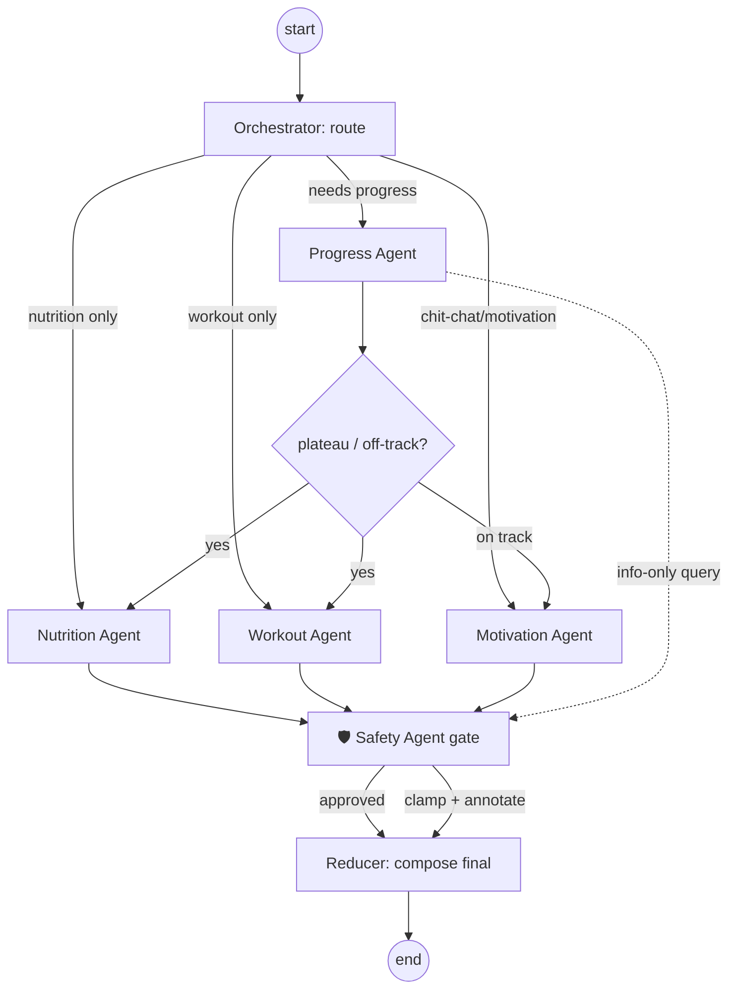

# 02 · Multi-Agent System

The heart of FitTwin. Six agents collaborate over a **single typed LangGraph state object**. The Orchestrator
routes; specialists produce structured proposals; the Safety agent gates; a reducer composes the final answer.

> Design principle: **agents own judgment, tools own arithmetic.** Every number a user could act on
> (calories, macros, plateau verdict) comes from a deterministic Python tool. The LLM decides *what to do* and
> *how to say it*, not *what 1.55 × BMR equals*.

---

## 0. Agent execution modes (the hybrid architecture)

FitTwin is **not** "all Python rules" and **not** "all LLM." It is deliberately **hybrid**: each agent declares
how much reasoning it delegates to a model, and the model is swappable per deployment. This is the single most
important AI-engineering decision after "tools own arithmetic."

### Per-agent classification

| Agent | Mode | Why |
|---|---|---|
| **Progress** | 🟦 **Rule-based** | Trend/plateau/adherence must be reproducible and explainable. No model needed. |
| **Safety** | 🟦 **Rule-based** | Guardrails are hard limits. A clamp can't be a vibe. (LLM only *phrases* the warning.) |
| **Nutrition** | 🟩 **LLM-powered** | Targets come from tools; the model assembles *meals* from a pre-filtered Indian catalog. |
| **Motivation** | 🟩 **LLM-powered** | Language work grounded in real streak/adherence numbers. |
| **AI Coach Chat** | 🟩 **LLM-powered** | Conversational synthesis over the specialists' structured outputs. |
| **Workout** | 🟨 **Hybrid** | Deterministic split/equipment selection (rules) + optional LLM personalization of exercises. |
| Orchestrator | 🟨 Hybrid | One cheap LLM intent classification; deterministic graph edges do the routing. |

### The pluggable model layer

Every LLM-touching agent calls a single abstraction (`app/ai/llm.py::get_llm()`), selected by env, with **four
interchangeable backends**:

```
LLM_PROVIDER = rule | gemini | openai | local
                │       │        │        └── Ollama (llama3.1 / qwen2.5) — offline, $0
                │       │        └────────── OpenAI (langchain_openai)
                │       └─────────────────── Gemini (langchain_google_genai) — default
                └─────────────────────────── rule-based mode: NO model; agents return their
                                              deterministic fallback verbatim (the `fake` provider)
```

- **`rule` mode is a first-class deployment**, not just a test stub. In rule mode every agent runs its
  deterministic core (tool-computed targets, template meals, template workouts, rule-based safety) and the app is
  fully usable **offline with no API key** — a strong demo and a real circuit-breaker fallback.
- Because the LLM only ever *enriches* a result the agent already computed (it receives a `fallback` and returns it
  on any error), **switching `rule → gemini → openai → local` is a one-line env change** and can never break a
  plan. The abstraction is the seam where future models (or a fine-tune) plug in.
- See [`§7`](#7-llm-provider--execution-mode-abstraction) for the adapter and
  [`01 ADR-4/ADR-8`](01-system-architecture.md#5-cross-cutting-architecture-decisions-adr-style-summary).

---

## 1. The shared graph state

```python
# app/agents/state.py
from typing import Literal, TypedDict, Annotated
from operator import add

class AgentState(TypedDict):
    # inputs (immutable within a run)
    user_id: str
    message: str | None                 # present for chat; None for scheduled review
    profile: dict                       # snapshot: age, sex, height, weight, goal, activity, diet, equipment, experience
    history: dict                       # aggregated logs: weight series, avg cals/protein, steps, adherence%
    active_plan: dict | None

    # routing
    intent: str | None
    route: list[str]                    # which specialists to run

    # specialist outputs (each writes its own slice)
    progress_result: dict | None
    nutrition_result: dict | None
    workout_result: dict | None
    motivation_result: dict | None

    # safety
    safety_verdict: dict | None         # {approved: bool, clamps: [...], warnings: [...]}

    # bookkeeping (append-only via reducer)
    steps: Annotated[list[dict], add]   # trace of node executions for AgentRun
    final: dict | None                  # composed response returned to user
```

Each node returns a **partial** state update; LangGraph merges it. `steps` uses an `add` reducer so every node
appends a trace entry — that becomes the persisted `AgentRun` (see [`03-data-model.md`](03-data-model.md)).

---

## 2. The graph



- **Conditional edges** out of `ROUTE` and `DECIDE` are functions over state (LangGraph `add_conditional_edges`),
  not LLM calls — fast and testable. The *intent classification* that fills `route` is one cheap LLM call (or a
  rules+LLM hybrid).
- **Safety is unconditional.** Every path that mutates a plan flows through `SAFE` before `COMPOSE`. You cannot
  produce a user-facing plan that skipped the gate.
- **Recursion limit + step budget + timeout** are set on the compiled graph to bound cost.

```python
graph = StateGraph(AgentState)
graph.add_node("route", orchestrator_route)
graph.add_node("progress", progress_agent)
graph.add_node("nutrition", nutrition_agent)
graph.add_node("workout", workout_agent)
graph.add_node("motivation", motivation_agent)
graph.add_node("safety", safety_agent)
graph.add_node("compose", compose_final)
graph.set_entry_point("route")
graph.add_conditional_edges("route", pick_specialists)      # -> subset of nodes
graph.add_conditional_edges("progress", after_progress)     # plateau? -> nutrition+workout | motivation
# nutrition/workout/motivation -> safety ; safety -> compose ; compose -> END
app_graph = graph.compile(checkpointer=mongo_saver)         # resumable runs
```

---

## 3. The six agents

### 3.1 Orchestrator Agent (Hybrid)
**Job:** receive query → classify intent → choose agents → maintain workflow state → compose output.
**Inputs:** message (or scheduled trigger), profile, history.
**Outputs:** `route`, then the merged `final` response.
**How:** one structured LLM call returns `{intent, route[], rationale}`; deterministic edges do the rest. It does
*not* generate plan content — it delegates. This separation keeps each specialist independently testable.

### 3.2 Nutrition Agent (LLM)
**Job:** BMR → TDEE → calorie target → macros → **India-first, personalized meal plan** → adapt.
**Inputs:** profile (incl. diet prefs, allergies, **budget tier, lifestyle, meals/day, cooking time**),
`progress_result`.
**Outputs:** `{calories, protein_g, carbs_g, fat_g, meal_plan[], archetype, changes[]}`.
**Tools (deterministic):**
```python
def bmr_mifflin(sex, weight_kg, height_cm, age) -> float        # Mifflin–St Jeor
def tdee(bmr, activity_level) -> float                          # ×1.2 … ×1.9
def calorie_target(tdee, goal, rate_kg_per_week) -> int         # deficit/surplus, clamped
def macros(calories, weight_kg, goal) -> Macros                 # protein 1.6–2.2 g/kg first, then fat 25%, rest carbs
```
**Indian-first food universe + personalization.** The model does **not** see the whole world of food. The agent:
1. computes targets (tools, above);
2. **pre-filters** the seeded Indian catalog (veg/non-veg staples — paneer, dal, rajma, chana, soy, roti, rice,
   curd, poha, idli, dosa, besan chilla, eggs, chicken, fish…) by `dietary_prefs`, `allergies`, **budget tier**,
   **hostel-friendliness**, and **cooking time** — so disallowed/unaffordable/uncookable foods are *impossible* to
   suggest, by construction;
3. selects a **meal-plan archetype** (Budget · High-protein · Hostel-friendly · Vegetarian · Non-vegetarian) and
   splits the day's macros into `meals_per_day` meals;
4. lets the **LLM choose & phrase** specific meals *within* that constrained, archetype-shaped candidate set.

Full catalog, archetypes, and personalization signals: [`08-domain-nutrition-equipment.md`](08-domain-nutrition-equipment.md).
*Why:* a wrong macro number is a real-world harm; an allergy/budget/diet violation is too — so those are data
constraints, not prompt requests. The LLM owns variety and language, never the constraints or the math.

### 3.3 Workout Agent (Hybrid)
**Job:** generate weekly program; progressive overload; intensity adjustment; gym vs home vs bodyweight.
**Inputs:** profile (experience, **`gym_type` + `equipment[]`**, days/week), `progress_result`.
**Outputs:** `{split, sessions[{day, exercises[{name, sets, reps, load_guidance}]}], progression_notes}`.
**Logic (the hybrid in action):**
- **Rules** select the split skeleton from `(experience, days)` and resolve each movement pattern to a concrete
  exercise via the **equipment→capability map** ([`08 §1.3`](08-domain-nutrition-equipment.md#13-equipment--exercise-capability-map)).
  "No dumbbells / no equipment" ⇒ the map walks to the first performable fallback (machine → band → bodyweight) —
  a real substitution, not a guess. Progressive overload (add reps → sets → load) is rule-driven off `adherence`.
- **LLM (optional)** personalizes exercise *naming/ordering/cues* inside the equipment-allowed set, and writes the
  guidance. In `rule` mode it is skipped entirely and the deterministic program ships.

The comprehensive equipment taxonomy (`full_commercial_gym` … `bodyweight_only`, plus the 13-item equipment list)
lives in [`08 §1`](08-domain-nutrition-equipment.md#1-equipment-taxonomy).

### 3.4 Progress Agent (Rule-based)
**Job:** track weight/calories/protein/steps/adherence; detect plateau vs improvement; weekly report.
**Inputs:** aggregated `history`.
**Outputs:** `{trend, slope_kg_per_week, plateau: bool, adherence_pct, highlights[], report_md}`.
**Tools (deterministic, the brain of adaptation):**
```python
def weight_trend(series) -> Trend            # linear regression slope + EWMA to kill daily water noise
def plateau_detected(trend, goal, weeks=2) -> bool   # |slope| < threshold while adherence high
def adherence(logs, plan) -> float           # % days logged within target bands
```
**Why tools:** plateau detection must be *explainable and consistent* ("0.05 kg/wk over 14 days while 92%
adherent"), never a vibe from the model.

### 3.5 Motivation Agent (LLM)
**Job:** daily check-ins, motivational messages, goal reminders, habit streaks.
**Inputs:** adherence, streaks, recent wins.
**Outputs:** `{message, streak_days, nudge, tone}`.
This is the one agent that is *mostly* LLM language work — grounded in real streak/adherence numbers so it's
specific ("12-day protein streak — one more for a personal best") not generic hype.

### 3.6 Safety Agent (Rule-based gate)
**Job:** prevent unhealthy deficits, unrealistic goals, overtraining, dangerous advice.
**Inputs:** proposed plan, profile, history.
**Outputs:** `{approved, clamps[], warnings[], requires_disclaimer}`.
**Rules (deterministic guardrails, LLM only for phrasing the warning):**
```python
MIN_CALORIES = {"female": 1200, "male": 1500}      # hard floor
MAX_DEFICIT_PCT = 0.25                              # ≤25% below TDEE
MAX_RATE_KG_WK = 0.01 * weight_kg                   # ~1%/wk loss cap
MAX_TRAINING_DAYS = 6                               # overtraining guard
```
If a proposed calorie target violates a floor, Safety **clamps** it (raises to the floor), annotates the reason,
and the clamped value is what gets stored/shown. Unrealistic goals ("lose 10 kg in 2 weeks") trigger a reframe +
disclaimer. **Medical red flags** (eating-disorder language, injury/pain, pregnancy) short-circuit to a
"please consult a professional" response. This agent is why the product can claim to be safe.

---

## 4. Intent → routing table

| User says | Intent | Route | Notable behavior |
|---|---|---|---|
| "I haven't lost weight this week" | `progress_concern` | Progress → (plateau) → Nutrition + Workout → Safety | Adaptation loop |
| "I gained 1 kg this week" | `progress_concern` | Progress → Nutrition (check noise vs trend) → Safety | EWMA avoids overreacting to water |
| "I ate 250g chicken and rice today" | `log_food` | (tool) parse + log → Nutrition (remaining macros) | Writes a `daily_log`, no full re-plan |
| "Create a vegetarian meal plan" | `nutrition_request` | Nutrition → Safety | Respects diet pref, keeps targets |
| "I have no dumbbells" | `equipment_change` | Workout (substitute) → Safety | Updates equipment in profile + re-plans workout |
| "Give me a pep talk" | `motivation` | Motivation | Grounded in streaks |
| "Is 1000 calories ok?" | `safety_question` | Safety (direct) | Educational + floor warning |

The food-logging path shows an important nuance: **not every message is a re-plan.** Logging is a cheap write +
a quick "you have X kcal / Y g protein left today" — the orchestrator distinguishes *log* from *advise*.

---

## 5. Collaboration example (full trace)

**User:** "I haven't lost weight this week."

```
route        → intent=progress_concern, route=[progress]
progress     → slope=-0.02 kg/wk (14d), adherence=92% ⇒ plateau=true
after_progress → plateau ⇒ go to nutrition + workout
nutrition    → TDEE recheck (weight ↓ since start ⇒ TDEE ↓) → deficit +100 kcal, hold protein 2.0 g/kg
workout      → add 1 progressive-overload set to compounds + 2×20min Zone-2 cardio
safety       → new target 1,780 kcal > floor 1,500 & deficit 18% < 25% ⇒ approved
compose      → coach message + updated targets card + new workout + weekly report
persist      → version plan v4, store WeeklyReport + AgentRun(steps[])
```

This is the literal flow from the spec (Progress → plateau → Nutrition → Workout → Safety → final), expressed as
graph edges so it's testable end-to-end with fixture data and **no LLM** (tools-only) in unit tests.

---

## 6. Prompting & reliability conventions

- **Structured outputs everywhere.** Each agent uses `with_structured_output(PydanticModel)` so the service layer
  receives validated objects, not free text. One self-heal retry on validation failure, then fall back to the
  deterministic tool result.
- **System prompts are versioned** in `app/agents/prompts/` and hashed into the `AgentRun` trace for reproducibility.
- **Token/cost budget** per run is enforced; specialists get only the state slice they need (not the whole history).
- **Every run is traced to LangSmith** (project tagged by env) — you can replay a user's exact weekly review.
- **Determinism for tests:** `temperature=0` in CI, and a `FakeLLM` provider returns canned structured outputs so
  the whole graph is unit-testable offline.

---

## 7. LLM provider & execution-mode abstraction

A single seam (`app/ai/llm.py`) decouples every agent from *how* reasoning happens. The same `get_llm()` selects
the **execution mode** (rule-based vs a real model) **and** the model vendor — see
[`§0`](#0-agent-execution-modes-the-hybrid-architecture) for the four-way switch.

```python
# app/ai/llm.py
class LLMProvider(Protocol):
    name: str
    def structured(self, *, system, user, schema, fallback): ...   # validated Pydantic out, or fallback
    def text(self, *, system, user, fallback=""): ...

def get_llm() -> LLMProvider:        # selected by env LLM_PROVIDER
    return {
        "rule":   FakeProvider,      # rule-based mode: returns the agent's deterministic fallback verbatim
        "fake":   FakeProvider,      # alias used in tests
        "gemini": GeminiAdapter,     # langchain_google_genai (default)
        "openai": OpenAIAdapter,     # langchain_openai
        "local":  OllamaAdapter,     # local open-source (llama3.1, qwen2.5) via Ollama
    }[settings.LLM_PROVIDER]()
```

- **The contract that makes it safe:** every real adapter takes the caller's `fallback` and returns it on *any*
  error (missing SDK, bad key, invalid JSON, timeout). So the LLM is strictly *additive* — it enriches a result the
  agent already computed deterministically, and can never break a plan. This is the circuit-breaker from
  [`01 §3`](01-system-architecture.md#failure-modes--mitigations), implemented at the seam.
- **`rule` / `fake`** = the hybrid system's rule-based mode: no model, no key, fully offline, deterministic.
- **`gemini`** is the default (free tier → good for a public portfolio); **`local`** (Ollama) runs the whole app
  **offline/free** on a laptop — a strong demo point; **`openai`** is a drop-in for higher quality.
- Swapping any of the four is a **one-line env change** — no agent code touches a vendor SDK. New backends (a
  fine-tuned model, a hosted open model, a future provider) plug in by adding one builder here.
