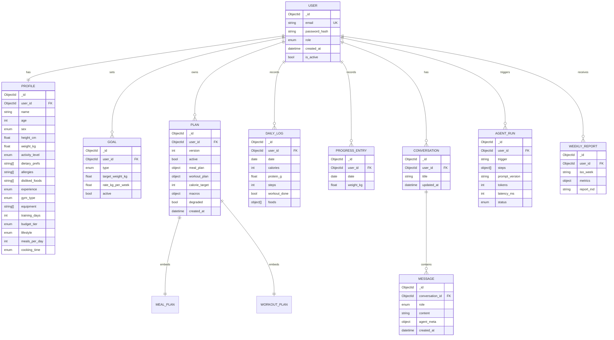

# 03 · Data Model (MongoDB + Beanie)

> Staff-engineer note: document databases reward modeling around **access patterns**, not normal forms. I state
> the access pattern, then choose embed-vs-reference, then justify each index by the query it serves.

---

## Why MongoDB (and not SQLAlchemy)

The original spec listed **both** SQLAlchemy and MongoDB. They're incompatible — SQLAlchemy is a SQL ORM; it does
not drive MongoDB. We pick **MongoDB + Beanie**:

- **Beanie** is an async ODM built on **Motor + Pydantic v2** → keeps the Pydantic requirement, gives typed
  documents, async-native for FastAPI.
- **Why a document store fits FitTwin:** profiles, plans, and meal/workout structures are nested, evolving,
  per-user documents — natural JSON. Plan versions and agent traces are semi-structured. Schema iterates fast
  during a portfolio build.
- **Honest counterpoint (interview gold):** A relational DB (**Postgres + SQLAlchemy**) would actually be a
  *stronger* choice for the heavily relational + time-series parts (daily logs, progress entries) and for
  analytical weekly aggregations. If asked "what would you change at scale," the answer is: move `daily_logs` /
  `progress_entries` to Postgres or a Mongo **time-series collection**, keep documents (profile/plan/convo) where
  they are. We choose Mongo for V1 velocity, eyes open.

---

## ER / Document Relationship Diagram



---

## Collections & key modeling decisions

| Collection | Embed or reference | Why |
|---|---|---|
| `users` | — | Auth root. Email unique. Never embeds profile (security: auth reads shouldn't drag PII/plan). |
| `profiles` | 1:1 ref to user | Read on nearly every agent call; kept small & separate so it caches well. |
| `goals` | ref, many per user (one `active`) | History of goals matters for adaptation; only one active. |
| `plans` | **versioned**, meal+workout **embedded** | A plan is read as a whole unit → embed sub-plans. New week = new `version`, old kept (audit + "what changed"). |
| `daily_logs` | ref, one doc per user per day | High write volume, queried by date range → its own collection, `{user_id, date}` unique. |
| `progress_entries` | ref, time-series | Weight series for trend math; separate from logs (different cadence). |
| `conversations` / `messages` | messages **referenced**, not embedded | Conversations grow unbounded → embedding hits the 16 MB doc cap. Classic Mongo pitfall avoided. |
| `agent_runs` | ref | Full execution trace per orchestration → observability + reproducibility. |
| `weekly_reports` | ref, one per ISO week | Idempotency key `{user_id, iso_week}` makes the weekly job safe to retry. |

**The big embed-vs-reference calls:** embed the *meal/workout plan inside the plan* (read together, bounded size);
**reference messages from conversations** (unbounded growth would blow the 16 MB document limit). Getting these
two right is exactly what a Mongo design interview probes.

---

## Beanie models (representative)

```python
# app/models/user.py
from beanie import Document, Indexed
from pydantic import EmailStr
from enum import Enum

class Role(str, Enum):
    user = "user"; coach = "coach"; admin = "admin"

class User(Document):
    email: Indexed(EmailStr, unique=True)
    password_hash: str
    role: Role = Role.user
    is_active: bool = True
    created_at: datetime = Field(default_factory=utcnow)
    class Settings:
        name = "users"

# app/models/log.py
class DailyLog(Document):
    user_id: Indexed(PydanticObjectId)
    date: date
    calories: int = 0
    protein_g: float = 0
    steps: int = 0
    water_ml: int = 0            # drives the "water intake" card + daily task
    sleep_hours: float = 0       # drives the "sleep goal" daily task
    workout_done: bool = False
    foods: list[FoodItem] = []
    class Settings:
        name = "daily_logs"
        indexes = [
            IndexModel([("user_id", 1), ("date", -1)], unique=True),  # one log/day, fast range reads
        ]

# app/models/plan.py
class Plan(Document):
    user_id: Indexed(PydanticObjectId)
    version: int
    active: bool = True
    calorie_target: int
    macros: Macros
    meal_plan: MealPlan          # embedded
    workout_plan: WorkoutPlan    # embedded
    degraded: bool = False       # set if generated via fallback (LLM down)
    created_at: datetime = Field(default_factory=utcnow)
    class Settings:
        name = "plans"
        indexes = [IndexModel([("user_id", 1), ("active", 1)])]
```

---

## Profile document (expanded)

The Profile carries everything the agent graph needs in **one read**. Beyond body metrics it now models the
**equipment context** and the **personalization signals** that drive the India-first nutrition + equipment-aware
training (catalogs and effects in [`08-domain-nutrition-equipment.md`](08-domain-nutrition-equipment.md)).

```python
# app/models/profile.py  (enums live in app/domain.py)
class Profile(Document):
    user_id: Indexed(PydanticObjectId)
    name: str; age: int; sex: Sex
    height_cm: float; weight_kg: float
    goal: Goal; rate_kg_per_week: float = 0.5      # denormalized goal (see note below)
    activity_level: ActivityLevel
    experience: Experience

    # ── equipment context (08 §1) ──
    gym_type: GymType = GymType.basic_gym          # full_commercial | basic | home | bodyweight_only
    equipment: list[Equipment] = []                # dumbbells, barbell, bands, kettlebells, pull_up_bar,
                                                   # bench, cable_machine, smith_machine, leg_press_machine,
                                                   # chest_press_machine, treadmill, exercise_bike, no_equipment
    training_days: int = 3

    # ── nutrition personalization (08 §4) ──
    dietary_prefs: list[str] = []                  # veg, nonveg, egg, jain, vegan, no_beef, no_pork, high_protein
    allergies: list[str] = []                      # lactose, gluten, nuts, soy, egg, seafood, …
    disliked_foods: list[str] = []                 # hard-excluded from candidate catalog
    budget_tier: BudgetTier = BudgetTier.moderate  # student | moderate | flexible
    lifestyle: Lifestyle = Lifestyle.home          # hostel | home | pg | working
    meals_per_day: int = 4                         # 3..6 — how the day's macros are split
    cooking_time: CookingTime = CookingTime.medium # none | low | medium | high

    class Settings:
        name = "profiles"
        indexes = [IndexModel([("user_id", 1)], unique=True)]
```

- **Why enums (not bare strings):** equipment and the personalization tiers are closed sets the agents branch on —
  modeling them as `app/domain.py` enums gives validation at the edge and a single source the frontend renders.
  (`equipment` is stored as the enum's string values, so existing `list[str]` data is forward-compatible.)
- **Denormalized goal:** for V1 velocity the active goal + rate live on the Profile so one read yields the full
  agent input; the `GOAL` collection remains the system of record for goal *history*. Documented trade-off.

> **Dashboard data is derived, not a new collection.** The richer dashboard (overview cards, nutrition/fitness
> insights, AI insights, daily-tasks widget — see [`05 §5a`](05-frontend.md#5a-dashboard-the-product-surface)) is
> **computed on read** by the Progress/Nutrition tools from existing `daily_logs`, `progress_entries`, the active
> `plan`, and `weekly_reports`. The only storage additions are `water_ml` / `sleep_hours` on `DailyLog` (above),
> which feed the water-intake card and the water/sleep daily tasks. No "dashboard" or "insights" collection — that
> would duplicate state and invite drift.

---

## Indexes (each justified by a query)

| Collection | Index | Serves |
|---|---|---|
| `users` | `email` unique | login lookup |
| `profiles` | `user_id` unique | load profile for every agent call |
| `plans` | `{user_id, active}` | "get my current plan" |
| `daily_logs` | `{user_id, date}` unique desc | dashboard range queries; one-log-per-day guard |
| `progress_entries` | `{user_id, date}` desc | weight-trend window for Progress Agent |
| `messages` | `{conversation_id, created_at}` | render a conversation in order |
| `agent_runs` | `{user_id, created_at}` | recent runs / debugging |
| `weekly_reports` | `{user_id, iso_week}` unique | idempotent weekly job |

**Time-series note:** `progress_entries` and `daily_logs` are append-mostly and queried by `(user_id, time
window)`. At scale, promote them to MongoDB **time-series collections** (`timeField=date, metaField=user_id`) for
better storage + range-scan performance. V1 uses the compound indexes above.

---

## Data integrity in a schemaless store

- **Validation at the edge:** Pydantic/Beanie enforce shape on write; Mongo **schema validators** add a
  server-side backstop on critical collections.
- **No cross-document transactions needed** in V1 (single-doc atomic writes cover plan versioning & log upserts).
  If a multi-doc invariant appears, Mongo multi-document transactions are available on a replica set.
- **Soft references:** integrity between `user_id` links is enforced in the repository layer (delete user →
  cascade cleanup job), since Mongo has no FKs. Documented explicitly so it isn't a silent footgun.
