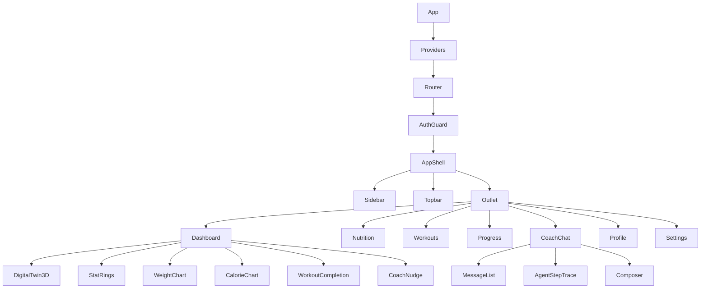

# 05 · Frontend (React + Vite)

A fast SPA with a **server-state / client-state split**: TanStack Query owns everything from the API; React
state/Zustand owns ephemeral UI. The look & motion live in [`06-design-system.md`](06-design-system.md) — this doc
is structure, data flow, and pages.

---

## 1. Folder structure

```
frontend/
├── index.html
├── vite.config.ts
├── tailwind.config.ts          # design tokens (see 06)
├── src/
│   ├── main.tsx                # Router + QueryClient + Theme providers
│   ├── App.tsx                 # route tree + layout shells
│   │
│   ├── app/
│   │   ├── router.tsx          # createBrowserRouter, route objects, guards
│   │   └── providers.tsx       # QueryClientProvider, AuthProvider, MotionConfig
│   │
│   ├── features/               # FEATURE-FIRST (colocate ui+hooks+api per domain)
│   │   ├── auth/               # LoginForm, useAuth, auth.api.ts, token store
│   │   ├── onboarding/         # multi-step profile wizard
│   │   ├── dashboard/          # DigitalTwin3D, StatRings, charts
│   │   ├── nutrition/          # MealPlan, MacroRings, FoodLogger
│   │   ├── workouts/           # WorkoutWeek, SessionCard, ExerciseRow
│   │   ├── progress/           # WeightChart, AdherenceHeatmap, WeeklyReport, RecapVideo
│   │   ├── chat/               # CoachChat (SSE), MessageList, AgentStepTrace
│   │   ├── profile/            # ProfileForm
│   │   └── settings/           # theme, units, LLM-provider (admin), account
│   │
│   ├── components/             # shared, dumb UI
│   │   ├── ui/                 # shadcn/ui primitives (button, card, dialog, ...)
│   │   ├── charts/             # Recharts wrappers themed to tokens
│   │   ├── motion/             # Framer Motion presets (FadeIn, Stagger, CountUp)
│   │   └── three/              # R3F scene, Twin model, lighting
│   │
│   ├── lib/
│   │   ├── api-client.ts       # fetch wrapper: base URL, auth header, refresh-on-401
│   │   ├── sse.ts              # EventSource helper for chat streaming
│   │   ├── query-keys.ts       # centralized TanStack Query keys
│   │   └── utils.ts            # cn(), formatters (kg/lb, kcal)
│   │
│   ├── hooks/                  # cross-feature (useMediaQuery, useReducedMotion)
│   ├── stores/                 # Zustand: ui store (sidebar, theme), auth token store
│   └── styles/                 # globals.css, fonts
└── Dockerfile                  # node build → nginx static
```

**Why feature-first, not type-first:** a `nutrition` change touches its component, hook, and API call together —
colocating them beats hunting across `components/`, `hooks/`, `api/`. Shared dumb UI still lives in `components/`.

---

## 2. Component hierarchy



---

## 3. State management strategy

| State kind | Owner | Examples |
|---|---|---|
| **Server state** | **TanStack Query** | profile, active plan, logs, progress series, conversations |
| **Auth tokens** | Zustand (persisted) + httpOnly refresh (V1.5) | access token in memory, refresh handled by client |
| **Ephemeral UI** | local `useState` / Zustand `uiStore` | sidebar open, active tab, theme, units (kg/lb) |
| **Streaming chat** | local reducer fed by SSE | partial assistant message, live agent steps |

- **Query keys** are centralized (`query-keys.ts`) so mutations can invalidate precisely — e.g. logging food
  invalidates `['logs', date]` and `['progress','series']` but not the plan.
- **Optimistic updates** on logging (calories/steps) for instant feedback; rollback on error.
- **No Redux.** Query handles the hard part (caching/refetch/dedupe); Zustand covers the tiny rest. Redux here
  would be ceremony.

---

## 4. API integration

```ts
// lib/api-client.ts — single choke point
export async function api<T>(path: string, init?: RequestInit): Promise<T> {
  const res = await fetch(`${BASE}/api/v1${path}`, withAuth(init));
  if (res.status === 401 && (await tryRefresh())) return api(path, init); // one retry
  if (!res.ok) throw await toApiError(res);   // normalized {code,message,request_id}
  return res.json();
}

// features/nutrition/nutrition.api.ts
export const useActivePlan = () =>
  useQuery({ queryKey: qk.plan.active, queryFn: () => api<Plan>('/plans/active') });

export const useLogFood = (date: string) => {
  const qc = useQueryClient();
  return useMutation({
    mutationFn: (f: FoodInput) => api(`/logs/${date}/food`, { method:'POST', body: json(f) }),
    onMutate: optimisticAddFood(qc, date),
    onSettled: () => { qc.invalidateQueries({queryKey: qk.logs(date)});
                       qc.invalidateQueries({queryKey: qk.progress.series}); },
  });
};
```

**Chat uses SSE** (not `fetch().json()`): `lib/sse.ts` opens an `EventSource`-style stream to
`/chat/.../messages`; the UI renders **agent steps as they arrive** ("🔎 Progress agent… 🥗 Nutrition agent…")
then streams the final tokens. This makes the multi-agent system *visible* — a great portfolio/demo moment.

---

## 5. Pages

| Page | Route | Core content |
|---|---|---|
| **Dashboard** | `/` | 3D Digital Twin, stat rings (cal/protein/steps), **weight chart, calorie chart, protein chart**, **goal progress**, **workout completion rate**, coach nudge |
| **Nutrition** | `/nutrition` | macro targets vs intake (rings), meal plan cards, food logger, "remaining today" |
| **Workouts** | `/workouts` | weekly split, session cards, exercise rows w/ progressive-overload hints, mark-done |
| **Progress** | `/progress` | weight trend + EWMA, adherence heatmap, weekly report (markdown), shareable recap video |
| **AI Coach** | `/coach` | streaming chat, agent-step trace, quick-prompts ("create a vegetarian meal plan", "I have no dumbbells") |
| **Profile** | `/profile` | edit onboarding fields, goal, equipment |
| **Settings** | `/settings` | units, theme, notifications, account; LLM provider (admin) |

**Onboarding wizard** (`/onboarding`) is the first-run multi-step form (name → body metrics → goal → activity →
diet/allergies → experience/equipment) that POSTs the profile then calls `/plans/generate` and animates the Twin
"coming to life."

---

## 6. Dashboard charts (Recharts, themed)

- **Weight chart** — line + EWMA overlay + goal line; annotation when Safety clamped a target.
- **Calorie / Protein charts** — bar (intake) vs reference line (target); over/under colored by token, not red/green
  clichés (uses `volt`/`coral`/`teal`).
- **Goal progress** — radial/arc toward target weight.
- **Workout completion rate** — weekly ring + streak.

All chart components read colors from CSS variables (design tokens), so light/dark and the athletic palette stay
consistent and themeable. Charts respect `prefers-reduced-motion` (no entrance animation when set).
