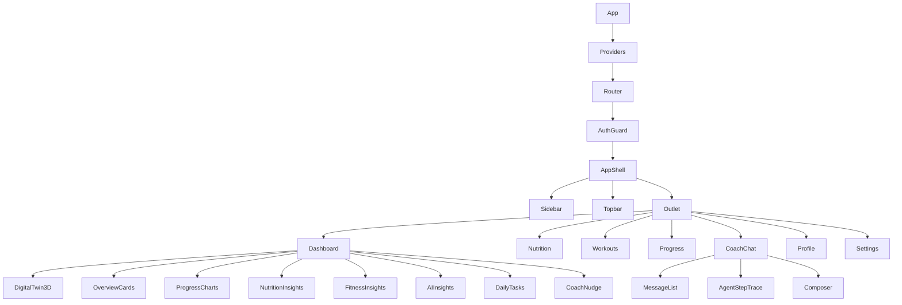

# 05 · Frontend (React + Vite)

A fast SPA with a **server-state / client-state split**: TanStack Query owns everything from the API; React
state/Zustand owns ephemeral UI. The look & motion live in [`06-design-system.md`](06-design-system.md) — this doc
is structure, data flow, and pages.

---

## 1. Folder structure

```
frontend/
├── index.html
├── vite.config.ts
├── tailwind.config.ts          # design tokens (see 06)
├── src/
│   ├── main.tsx                # Router + QueryClient + Theme providers
│   ├── App.tsx                 # route tree + layout shells
│   │
│   ├── app/
│   │   ├── router.tsx          # createBrowserRouter, route objects, guards
│   │   └── providers.tsx       # QueryClientProvider, AuthProvider, MotionConfig
│   │
│   ├── features/               # FEATURE-FIRST (colocate ui+hooks+api per domain)
│   │   ├── auth/               # LoginForm, useAuth, auth.api.ts, token store
│   │   ├── onboarding/         # multi-step profile wizard
│   │   ├── dashboard/          # DigitalTwin3D, StatRings, charts
│   │   ├── nutrition/          # MealPlan, MacroRings, FoodLogger
│   │   ├── workouts/           # WorkoutWeek, SessionCard, ExerciseRow
│   │   ├── progress/           # WeightChart, AdherenceHeatmap, WeeklyReport, RecapVideo
│   │   ├── chat/               # CoachChat (SSE), MessageList, AgentStepTrace
│   │   ├── profile/            # ProfileForm
│   │   └── settings/           # theme, units, LLM-provider (admin), account
│   │
│   ├── components/             # shared, dumb UI
│   │   ├── ui/                 # shadcn/ui primitives (button, card, dialog, ...)
│   │   ├── charts/             # Recharts wrappers themed to tokens
│   │   ├── motion/             # Framer Motion presets (FadeIn, Stagger, CountUp)
│   │   └── three/              # R3F scene, Twin model, lighting
│   │
│   ├── lib/
│   │   ├── api-client.ts       # fetch wrapper: base URL, auth header, refresh-on-401
│   │   ├── sse.ts              # EventSource helper for chat streaming
│   │   ├── query-keys.ts       # centralized TanStack Query keys
│   │   └── utils.ts            # cn(), formatters (kg/lb, kcal)
│   │
│   ├── hooks/                  # cross-feature (useMediaQuery, useReducedMotion)
│   ├── stores/                 # Zustand: ui store (sidebar, theme), auth token store
│   └── styles/                 # globals.css, fonts
└── Dockerfile                  # node build → nginx static
```

**Why feature-first, not type-first:** a `nutrition` change touches its component, hook, and API call together —
colocating them beats hunting across `components/`, `hooks/`, `api/`. Shared dumb UI still lives in `components/`.

---

## 2. Component hierarchy



---

## 3. State management strategy

| State kind | Owner | Examples |
|---|---|---|
| **Server state** | **TanStack Query** | profile, active plan, logs, progress series, conversations |
| **Auth tokens** | Zustand (persisted) + httpOnly refresh (V1.5) | access token in memory, refresh handled by client |
| **Ephemeral UI** | local `useState` / Zustand `uiStore` | sidebar open, active tab, theme, units (kg/lb) |
| **Streaming chat** | local reducer fed by SSE | partial assistant message, live agent steps |

- **Query keys** are centralized (`query-keys.ts`) so mutations can invalidate precisely — e.g. logging food
  invalidates `['logs', date]` and `['progress','series']` but not the plan.
- **Optimistic updates** on logging (calories/steps) for instant feedback; rollback on error.
- **No Redux.** Query handles the hard part (caching/refetch/dedupe); Zustand covers the tiny rest. Redux here
  would be ceremony.

---

## 4. API integration

```ts
// lib/api-client.ts — single choke point
export async function api<T>(path: string, init?: RequestInit): Promise<T> {
  const res = await fetch(`${BASE}/api/v1${path}`, withAuth(init));
  if (res.status === 401 && (await tryRefresh())) return api(path, init); // one retry
  if (!res.ok) throw await toApiError(res);   // normalized {code,message,request_id}
  return res.json();
}

// features/nutrition/nutrition.api.ts
export const useActivePlan = () =>
  useQuery({ queryKey: qk.plan.active, queryFn: () => api<Plan>('/plans/active') });

export const useLogFood = (date: string) => {
  const qc = useQueryClient();
  return useMutation({
    mutationFn: (f: FoodInput) => api(`/logs/${date}/food`, { method:'POST', body: json(f) }),
    onMutate: optimisticAddFood(qc, date),
    onSettled: () => { qc.invalidateQueries({queryKey: qk.logs(date)});
                       qc.invalidateQueries({queryKey: qk.progress.series}); },
  });
};
```

**Chat uses SSE** (not `fetch().json()`): `lib/sse.ts` opens an `EventSource`-style stream to
`/chat/.../messages`; the UI renders **agent steps as they arrive** ("🔎 Progress agent… 🥗 Nutrition agent…")
then streams the final tokens. This makes the multi-agent system *visible* — a great portfolio/demo moment.

---

## 5. Pages

| Page | Route | Core content |
|---|---|---|
| **Dashboard** | `/` | rich bento surface: 3D Twin, **8 overview cards**, **progress charts**, **nutrition + fitness insights**, **AI insights**, **daily-tasks widget**, coach nudge — full breakdown in [§5a](#5a-dashboard-the-product-surface) |
| **Nutrition** | `/nutrition` | macro targets vs intake (rings), **meal-plan archetype switch** (budget / high-protein / hostel / veg / non-veg), India-first meal cards, food logger, "remaining today" |
| **Workouts** | `/workouts` | weekly split, session cards, exercise rows w/ progressive-overload hints, mark-done |
| **Progress** | `/progress` | weight trend + EWMA, adherence heatmap, weekly report (markdown), shareable recap video |
| **AI Coach** | `/coach` | streaming chat, agent-step trace, quick-prompts ("create a vegetarian meal plan", "I have no dumbbells") |
| **Profile** | `/profile` | edit onboarding fields, goal, equipment |
| **Settings** | `/settings` | units, theme, notifications, account; **agent execution mode** (admin — `rule`/`gemini`/`openai`/`local`, [`02 §0`](02-multi-agent-system.md#0-agent-execution-modes-the-hybrid-architecture)) |

**Onboarding wizard** (`/onboarding`) is the first-run multi-step form (name → body metrics → goal → activity →
diet/allergies/**dislikes** → **budget/lifestyle/meals-per-day/cooking-time** → experience → **gym type +
equipment**) that POSTs the profile then calls `/plans/generate` and animates the Twin "coming to life." The
equipment + personalization steps are detailed in [§7](#7-onboarding--personalization-step).

---

## 5a. Dashboard (the product surface)

The dashboard is **not minimal** — it should feel like a real fitness product. A **bento grid** of varied tiles,
each fed by a focused API ([`04 §Dashboard`](04-backend.md#dashboard-read-only-aggregations--see-05-5a)), all
**derived on read** (no dashboard tables — see [`03`](03-data-model.md#profile-document-expanded)).

### Overview cards — `GET /dashboard/summary`
Eight big-number tiles with CountUp + ring/sparkline: **Current Weight · Target Weight · Calories Remaining Today ·
Protein Remaining Today · Daily Water Intake · Daily Steps · Workout Completion % · Current Streak**.

### Progress charts — `GET /progress/series` (+ summary)
**Weight Trend** (weekly & monthly toggle, EWMA + goal line) · **Calorie Intake Trend** · **Protein Intake Trend**
· **Workout Adherence Trend** · **Steps Trend** · **Estimated Goal-Completion Date** (projected from the weight
slope; "~10 weeks" — annotated, never a false-precision promise). Chart specifics in [§6](#6-dashboard-charts-recharts-themed).

### Nutrition insights — `GET /dashboard/nutrition-insights`
**Average Calories This Week · Average Protein This Week · Macro Breakdown** (donut) · **Meal Adherence %**.

### Fitness insights — `GET /dashboard/fitness-insights`
**Total Workouts Completed · Total Hours Trained · Favorite Muscle Group · Most-Missed Workout Day**.

### AI insights — `GET /dashboard/insights`
A feed of grounded, plain-language observations from the Progress agent (rule-derived facts; LLM phrasing optional,
skipped in `rule` mode). Examples — *"Your weight loss has slowed this week." · "Protein has been below target for
5 days." · "You consistently train legs less than other groups." · "You may reach your goal in ~10 weeks."* Each
carries a `severity` token (info/`teal`, nudge/`amber`, win/`volt`) so the UI colors it without clichéd red/green.

### Daily-tasks widget — `GET /dashboard/tasks?date=`
Check-off habits with progress: **Drink Water · Hit Protein Goal · Complete Workout · Walk Goal · Sleep Goal**.
Toggling writes back via `PUT /logs/{date}` (water/sleep/steps/workout_done) with an **optimistic update** and a
coral streak-pop on completion (see [`06 §4`](06-design-system.md#4-motion-language-framer-motion)).

> **Empty/first-run states stay motivational, not sterile** ("Log your first day to wake up your Twin"). Every tile
> degrades gracefully before there's data — it shows the target and a "—" rather than an error.

---

## 6. Dashboard charts (Recharts, themed)

- **Weight chart** — line + EWMA overlay + goal line; **weekly/monthly toggle**; annotation when Safety clamped a target.
- **Calorie / Protein / Steps charts** — bar (intake) vs reference line (target); over/under colored by token, not
  red/green clichés (uses `volt`/`coral`/`teal`).
- **Workout adherence trend** — weekly bars of completed vs planned sessions.
- **Goal progress** — radial/arc toward target weight, with the **estimated completion date** projected from the slope.
- **Workout completion rate** — weekly ring + streak.

All chart components read colors from CSS variables (design tokens), so light/dark and the athletic palette stay
consistent and themeable. Charts respect `prefers-reduced-motion` (no entrance animation when set).

---

## 7. Onboarding & personalization step

The wizard collects the equipment context and personalization signals the agents need (catalogs:
[`08`](08-domain-nutrition-equipment.md); storage: [`03`](03-data-model.md#profile-document-expanded); options
served by `GET /catalog/equipment` + `GET /catalog/diet-options` so nothing is hard-coded client-side).

- **Equipment step.** First a single-select **gym type** (`Full Commercial Gym · Basic Gym · Home Gym · Bodyweight
  only`) that pre-checks a sensible default item set; then a grouped **multi-select** of the 13 equipment items
  (dumbbells, adjustable dumbbells, bands, kettlebells, pull-up bar, bench, cable, smith, leg-press, chest-press,
  treadmill, exercise bike, barbell). "No equipment" is mutually exclusive and clears the rest.
- **Nutrition personalization step.** Diet prefs (veg/non-veg/egg/jain/vegan…), allergy presets + free-text,
  disliked foods, **budget tier** (student/moderate/flexible), **lifestyle** (hostel/home/PG/working),
  **meals per day** (3–6), and **cooking time** (none/low/medium/high). These drive the meal-plan archetype
  ([`08 §3`](08-domain-nutrition-equipment.md#3-meal-plan-archetypes)) — e.g. *student + hostel + low budget* →
  Budget + Hostel-friendly by default.
- **Editable later** from `/profile` — changing equipment or diet re-plans (the "I have no dumbbells" / "make it
  high-protein" flows route through the Workout/Nutrition agents, [`02 §4`](02-multi-agent-system.md#4-intent--routing-table)).
