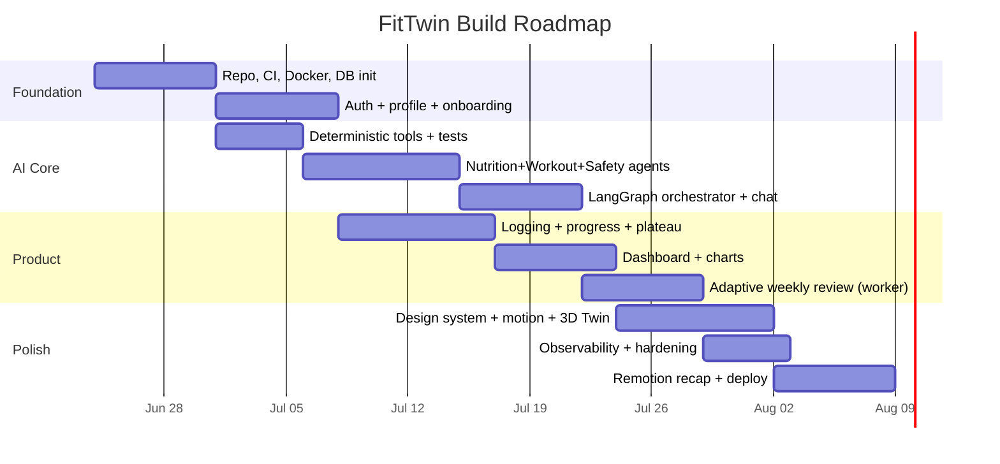

# 07 · Roadmap, Sprints, Prioritization & Resume Copy

---

## 1. Feature prioritization (RICE + MoSCoW)

RICE = Reach × Impact × Confidence ÷ Effort. Higher = do first. (Reach/Impact 1–5, Confidence %, Effort in
person-weeks.)

| Feature | R | I | C | E | RICE | MoSCoW |
|---|---|---|---|---|---|---|
| Auth + profile onboarding | 5 | 5 | 95% | 1.0 | **23.8** | Must |
| Deterministic nutrition tools (BMR/TDEE/macros) | 5 | 5 | 95% | 0.5 | **47.5** | Must |
| Plan generation (Nutrition+Workout+Safety agents) | 5 | 5 | 80% | 2.0 | **10.0** | Must |
| Daily logging (cal/protein/steps/workout) | 5 | 4 | 90% | 1.0 | **18.0** | Must |
| Progress tracking + plateau detection | 4 | 5 | 85% | 1.5 | **11.3** | Must |
| Dashboard charts (weight/cal/protein/goal/workout) | 5 | 4 | 90% | 1.5 | **12.0** | Must |
| Adaptive weekly re-plan (the differentiator) | 4 | 5 | 75% | 2.0 | **7.5** | Must |
| AI Coach chat (SSE, agent routing) | 4 | 4 | 75% | 2.0 | **6.0** | Should |
| Athletic design system + Framer Motion | 5 | 3 | 90% | 1.5 | **9.0** | Should |
| 3D Digital Twin (R3F) | 3 | 4 | 70% | 1.5 | **5.6** | Should |
| Observability (LangSmith, structlog, metrics) | 3 | 3 | 90% | 1.0 | **8.1** | Should |
| Remotion weekly recap video | 2 | 3 | 60% | 1.5 | **2.4** | Could |
| Admin/coach trace viewer | 2 | 2 | 80% | 0.5 | **6.4** | Could |
| Wearables · voice · food-image (V2) · RAG · long-term memory · medical-report analysis (V3) | — | — | — | — | — | Won't (now) |

**Read:** the deterministic math tools have the highest RICE (tiny effort, huge correctness payoff) — build them
*first*, before any agent. The adaptive weekly loop is lower RICE but it's the **product thesis**, so it's still a
Must.

---

## 2. Development roadmap (milestones)

Target: **~8–9 weeks solo, part-time** to a deployed V1.

---

## 3. Sprint plan (2-week sprints)

### Sprint 0 — Foundation (Must)
- Monorepo (`backend/`, `frontend/`), Docker Compose (api, web, mongo, mongo-express), `.env.example`.
- GitHub Actions: lint + type-check + tests on PR.
- Beanie init, `User` model, `/health`.
- **Exit:** `docker compose up` serves a logged-out web shell hitting a live API + Mongo.

### Sprint 1 — Identity & onboarding (Must)
- Argon2 hashing, JWT access/refresh, `/auth/*`, RBAC dependency, rate limit on auth.
- Profile model + `/profile`; React onboarding wizard; auth guard + token client.
- **Exit:** a user can register, onboard, and see an (empty) dashboard.

### Sprint 2 — AI core (Must)
- **Deterministic tools first** (nutrition_math, progress_math, food_parser) with unit tests (no LLM).
- LLM provider adapter (gemini/openai/ollama/**fake**).
- Nutrition + Workout + Safety agents → `POST /plans/generate` → versioned plan.
- **Exit:** onboarding produces a real, safety-clamped plan; agent graph unit-tested with FakeLLM.

### Sprint 3 — Logging, progress & dashboard (Must)
- Daily logs + weight entries; `/logs`, `/progress/*`.
- Progress agent: trend (EWMA + regression) + plateau detection + weekly report.
- Dashboard: stat rings + weight/calorie/protein charts + goal/workout-completion.
- **Exit:** log data → charts update; plateau is detectable from real logs.

### Sprint 4 — Orchestrator, chat & adaptation (Must/Should)
- LangGraph orchestrator + intent routing; `POST /chat/...` over **SSE** with visible agent steps.
- Worker + APScheduler weekly review (idempotent per ISO week) → versioned re-plan + report.
- **Exit:** "I haven't lost weight this week" runs the full collaboration and updates the plan.

### Sprint 5 — Identity of the product (Should)
- Athletic design system + tokens + Framer Motion presets across all pages.
- 3D Digital Twin (lazy, reduced-motion fallback).
- Observability: structlog + request-id, LangSmith traces, `/metrics`, Sentry.
- **Exit:** the app *looks and moves* like a premium fitness product; runs are traceable.

### Sprint 6 — Ship & delight (Could)
- Remotion weekly recap video + `/progress/recap`.
- Admin/coach trace viewer; rate-limit polish; load test the LLM path + circuit breaker.
- Production deploy (Atlas + VM/PaaS + TLS), README/screens/Loom demo.
- **Exit:** public URL, demo video, polished README — portfolio-ready.

---

## 4. Production deployment strategy

1. **Build & CI** — GitHub Actions: lint/type/test → build images → push to GHCR.
2. **Environments** — `dev` (compose) → `prod` (single small VM or Render/Railway/Fly). One env file per env;
   secrets via the platform's secret store, never in the image.
3. **Data** — **MongoDB Atlas** (managed, free tier ok) with daily backups; Redis managed (V1.5).
4. **Runtime** — `api` (uvicorn+gunicorn workers) + `worker` (scheduler) behind Caddy/Nginx (TLS, gzip, static web).
5. **Releases** — image tags by git SHA; roll forward; `/health/ready` gates traffic; DB changes are additive
   (document store → no lockstep migrations, but a `schema_version` field per doc + lazy migration on read).
6. **Cost control** — LLM is the cost center: cache plan generations, batch weekly reviews, per-user rate limits,
   circuit-breaker → template fallback; default provider Gemini free tier (or Ollama for $0 demos).
7. **Observability in prod** — LangSmith project per env, Sentry alerts, Prometheus/Grafana (or platform metrics),
   uptime ping on `/health`.
8. **Security** — TLS+HSTS, secret rotation, dependency scanning (Dependabot), rate limiting, least-privilege DB user.

---

## 5. Future versions — explicitly NOT in V1

These are **deliberately deferred**. V1's value is multi-agent collaboration + product engineering, not retrieval
or hardware integrations. The architecture is built to *accept* each later without a rewrite — the table notes the
seam that makes it a drop-in.

| Capability | Version | Why deferred | Seam already in place |
|---|---|---|---|
| **Wearable integrations** (Apple Health / Google Fit / Garmin — steps, HR, sleep) | V2 | OAuth + per-vendor sync is its own project; V1 takes manual logs | `daily_logs` already holds steps/sleep/water; an ingestion adapter writes the same docs |
| **Food image recognition** | V2 | Vision model + cost + accuracy bar | a vision step feeds the existing `food_parser` tool → unchanged downstream |
| **Voice assistant** | V2 | Web Speech / STT is a UI concern, not core value | speech → text → the **same** chat orchestrator endpoint |
| **Long-term per-user memory** (preferences, what worked) | V3 | Needs a vector store + retrieval policy | `AgentRun` traces + `weekly_reports` are the corpus; memory is read into `AgentState.history` |
| **RAG** over exercise-science literature (cited advice) | V3 | No vector DB in V1 by design | the agent layer already passes context slices; RAG adds a retrieval node before specialists |
| **Medical report analysis** | V3 | Regulatory + safety bar is high; needs clinician review | Safety agent is already the gate; a parsed-report becomes another constraint it enforces |

**The design rule:** every V2/V3 feature plugs into an existing seam (a tool, an `AgentState` slice, a graph node,
or a log document) — none requires re-architecting the agent graph, the data model, or the API layering. That
"extensible by construction" property is itself a V1 deliverable.

---

## 6. Resume-worthy descriptions

### One-liner
> Built **FitTwin**, a full-stack multi-agent AI fitness coach (LangGraph + FastAPI + React) where 6 specialized
> agents collaborate to generate and **weekly-adapt** personalized nutrition/training plans, with a safety agent
> that gates every recommendation.

### Bullet form (drop into a CV)
- Architected a **6-agent LangGraph system** (Orchestrator, Nutrition, Workout, Progress, Motivation, Safety) over
  a typed shared state with conditional routing and a **safety gate** that clamps unsafe plans before persistence.
- Kept all health-critical math (**BMR/TDEE/macros, plateau detection**) in deterministic, unit-tested Python
  tools — LLMs handle language/synthesis only — making outputs reproducible and testable **offline** with a fake
  provider.
- Built a **FastAPI** backend in a clean layered architecture (router→service→agent→repository) with **JWT
  access/refresh, Argon2, RBAC, rate limiting**, and **MongoDB/Beanie** modeling (versioned plans, time-series
  logs, referenced conversations).
- Implemented an **adaptive weekly re-planning loop** in a separate scheduled worker that detects plateaus from
  logged data and re-tunes nutrition + training.
- Shipped a distinctive **React + Vite** UI (TanStack Query, Recharts, **Framer Motion**, a **React Three Fiber
  3D "digital twin,"** and **Remotion** auto-generated recap videos) — deliberately *not* the typical dark-AI look.
- **Dockerized** end-to-end with CI; instrumented with **structured logging, request tracing, and LangSmith** agent
  traces.

### Paragraph (portfolio "about")
> FitTwin is a production-shaped, multi-agent AI fitness coach. Six LangGraph agents collaborate over a shared
> state to build personalized nutrition and training plans, while a Progress agent mines the user's logged data
> for plateaus and a Safety agent vetoes anything unhealthy. A scheduled worker re-plans every week. The FastAPI
> backend uses a strict layered architecture with JWT/RBAC security and MongoDB persistence; the LLM layer is
> provider-agnostic (Gemini/OpenAI/Ollama). The React frontend pairs serious data viz with an athletic design
> language, a 3D digital twin, and shareable recap videos — proving the product can be both rigorous and delightful.
